# BGIDB

A Browser Server software for the management of both fundus image and retinal OCT image

front end: JS, HTML, CSS(Bootstrap)

back end: PHP (Thinkphp)

Contact: howard@tju.edu.cn

Author: Qi He

## Fundus image

Optic disc:

| B-Spline mode (Disc) | Ovel mode (Disc) | Adaptive oval mode (Disc) |
| :-------------: |:-------------:|:-------------:|
| 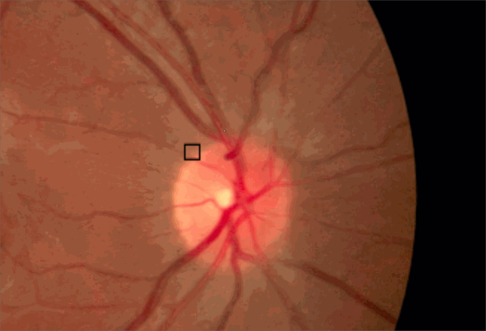 |  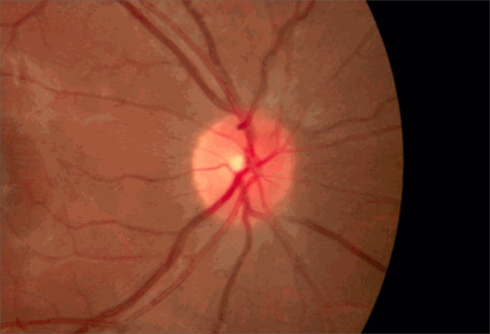 | 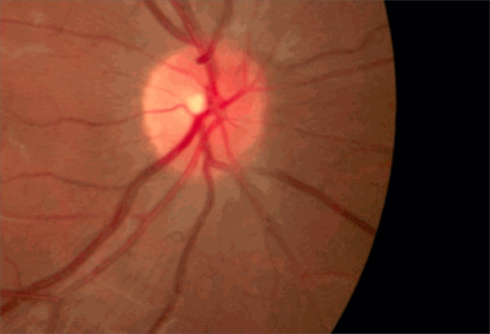 |

Optic cup:

| B-Spline mode (Cup) | Ovel mode (Cup) | Adaptive oval mode (Cup) |
| :-------------: |:-------------:|:-------------:|
|  |  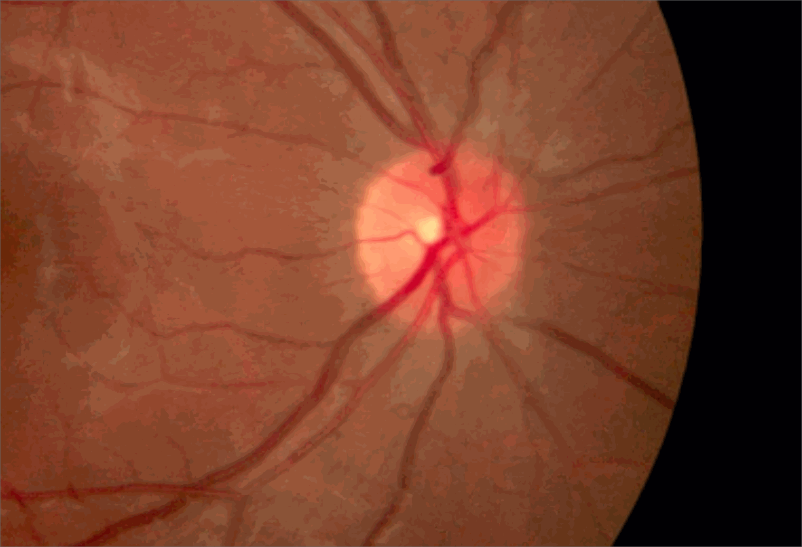 | 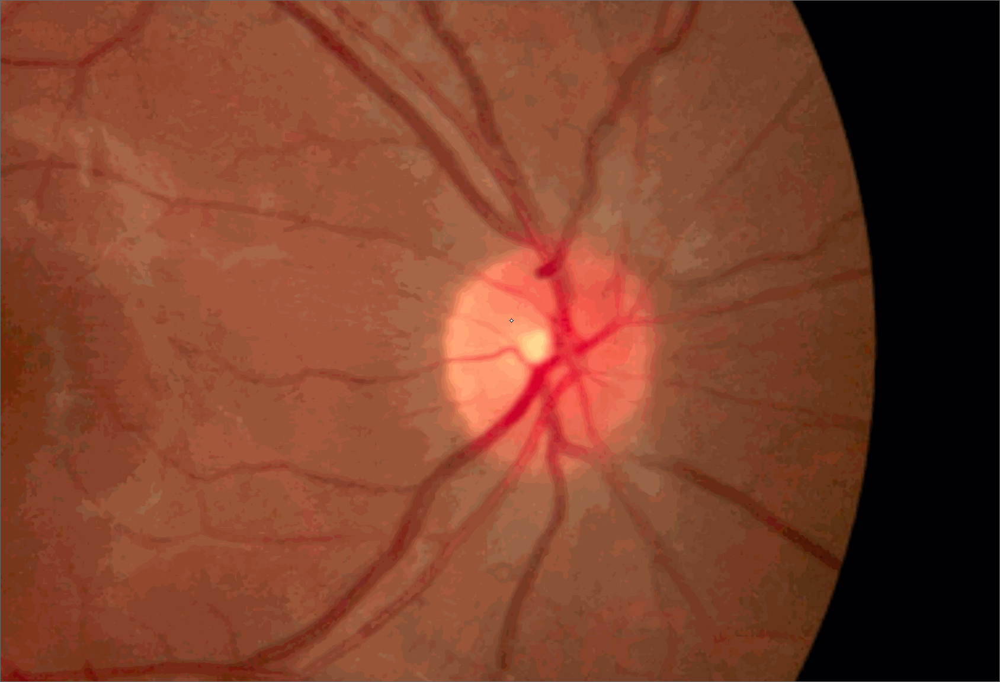 |

Export mask:

| B-Spline mode  (Disc/Cup) | 
| :-------------: |
| 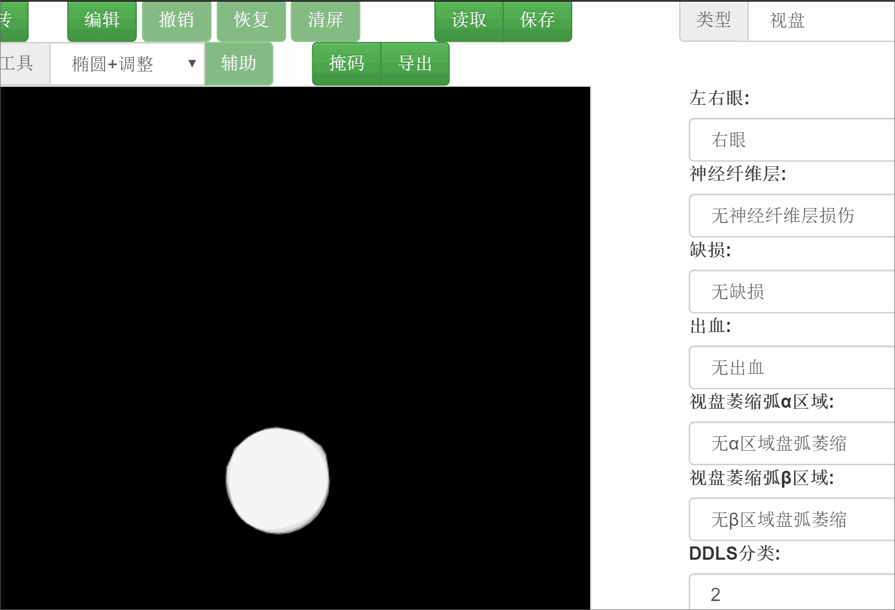 |

## OCT Image


| OCT files browser |Preview layers | Check layer list|
| :-------------: |:-------------:|:-------------:|
|  |  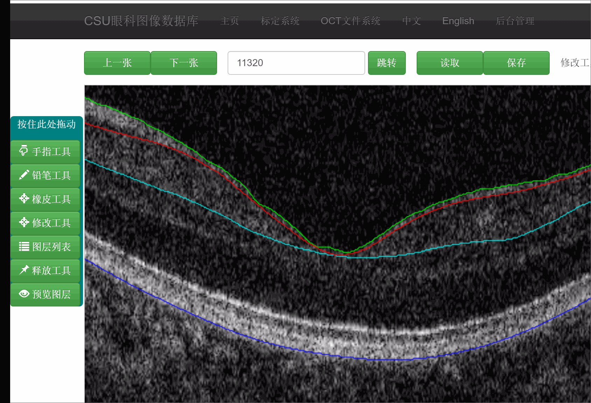 | 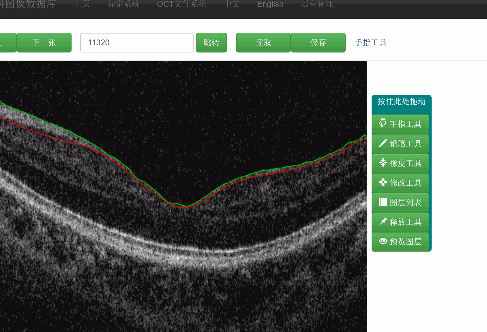 |

| Draw | Erase | Modify |
| :-------------: |:-------------:|:-------------:|
| 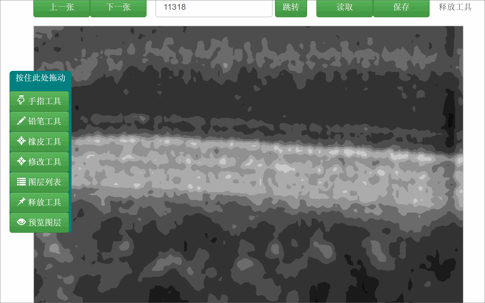 |  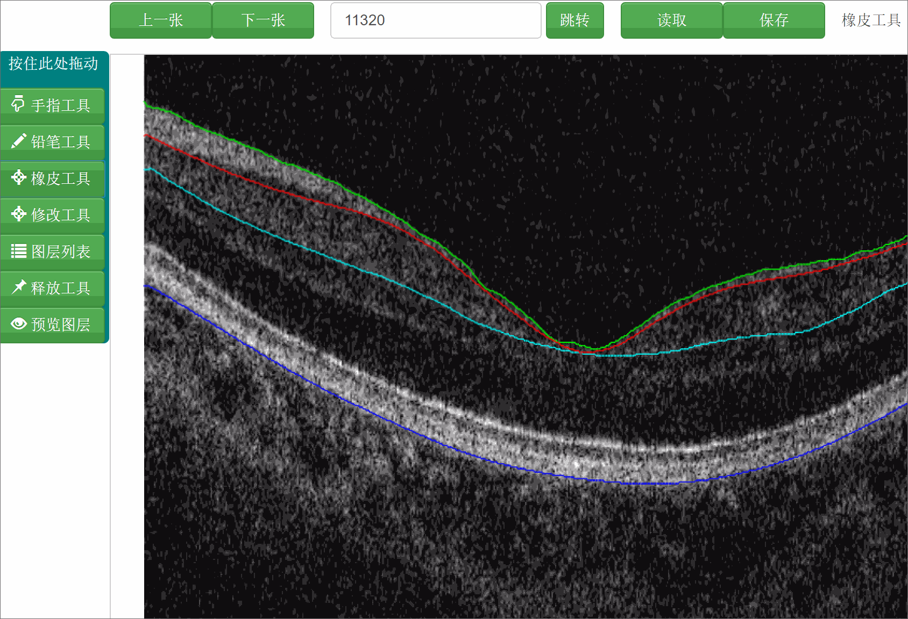 | 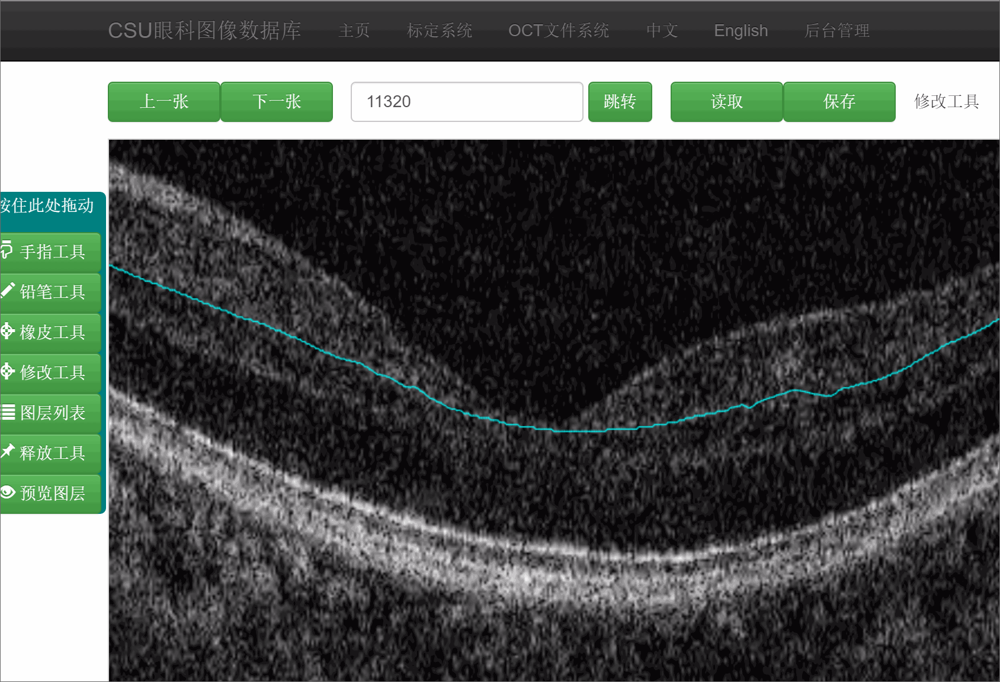 |

| Move | Zoom in/out | - |
| :-------------: |:-------------:|:-------------:|
| 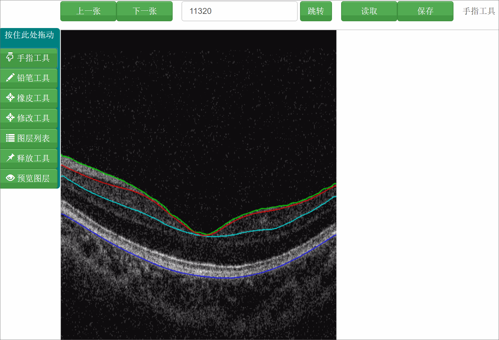) |   | - |


Import/Export image:

| import fundus image and OCT image | import the labeled mask of fundus image and OCT image |
| :-------------: | :-------------: |
|  |  |

## Reference
If you find our work useful in your research, please consider citing our paper:
```
@article{zou2018bgidb,
  title={BGIDB: A fundus ground truth building tool with automatic DDLS classification for glaucoma research},
  author={Zou, Bei-ji and Guo, Yun-di and Chen, Zai-liang and He, Qi and Zhu, Cheng-zhang and Ouyang, Ping-bo},
  journal={Journal of Central South University},
  volume={25},
  number={9},
  pages={2058--2068},
  year={2018},
  publisher={Springer}
}
}
```
