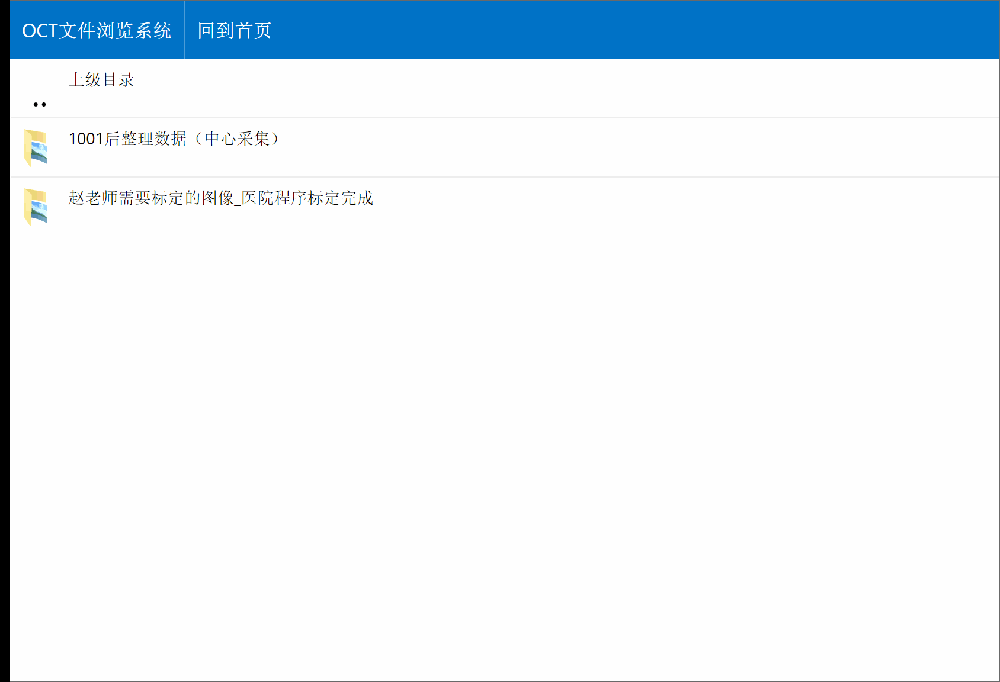
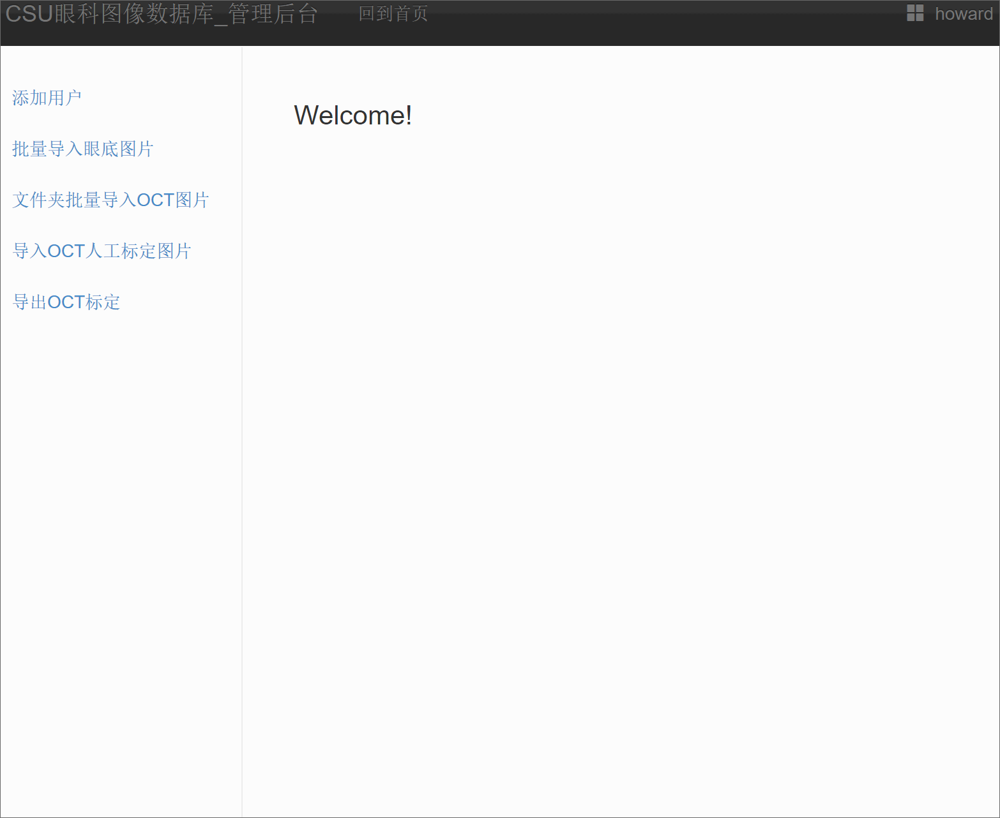

# BGIDB
A Browser Server software for the management of both fundus image and retinal OCT image
front end: JS, HTML, CSS(Bootstrap)
back end: PHP (Thinkphp)
Contact: howard@csu.edu.cn / heqi_work@qq.com 
Author: Qi He

## Fundus image

Optic disc:

| B-Spline mode (Disc) | Ovel mode (Disc) | Adaptive oval mode (Disc) |
| :-------------: |:-------------:|:-------------:|
|  |   |  |

Optic cup:

| B-Spline mode (Cup) | Ovel mode (Cup) | Adaptive oval mode (Cup) |
| :-------------: |:-------------:|:-------------:|
|  |   |  |

Export mask:

| B-Spline mode  (Disc/Cup) | 
| :-------------: |
|  |

## OCT Image

| OCT files browser |Preview layers | Check layer list|
| :-------------: |:-------------:|:-------------:|
|  |   |  |

| Draw | Erase | Modify |
| :-------------: |:-------------:|:-------------:|
|  |   |  |

| Move | Zoom in/out | - |
| :-------------: |:-------------:|:-------------:|
| ) |   | - |

Import/Export image:

| import fundus image and OCT image | import the labeled mask of fundus image and OCT image |
| :-------------: | :-------------: |
|  |  |
